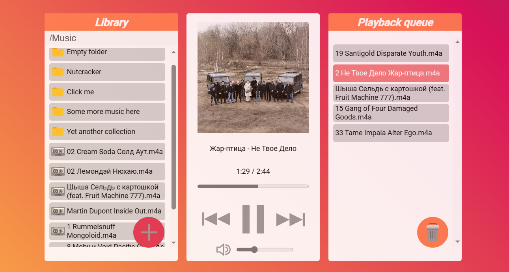

# DriveTracks

DriveTracks is a music player for your music collection hosted on Google Drive. Navigate your collection, build a playlist and enjoy your music!

App features: 
* Google authentication
* Google Drive navigation that filters out non-audio files to focus on music only
* Clean user interface with familiar playback controls and cover art display
* A choice of means to build a playback queue: add and remove tracks in batches or select tracks by click, use drag-and-drop to add and re-order tracks
* Non-destructive scope: the app cannot modify or delete user files

A short [video](https://youtu.be/bfb1Rm9EXqM) about this project.



# Getting started

The app uses Google Drive API and it is not published for now. To get hands-on with the app you will need a Google Developer account, a configured Google Cloud workspace, an API key and other credentials (you can start with this [guide](https://developers.google.com/workspace/guides/get-started)).

Provided you have the Google setup in place, to run the app:
1. fork this repository and clone it
2. make sure that you have Node.js installed or install it and run `npm install` command from the project directory to install all the dependencies 
3. create `env.ts` file in `src` directory and provide introduce necessary variables (or populate and rename `example_env.ts` file): 

```TypeScript
export const API_KEY = "YOUR API KEY";
export const CLIENT_ID = "YOUR CLIENT ID";
export const SCOPES = "https://www.googleapis.com/auth/drive.readonly https://www.googleapis.com/auth/drive.metadata";
export const DISCOVERY_DOC = "https://www.googleapis.com/discovery/v1/apis/drive/v3/rest";
```

4. run `ng serve --open` command from the project directory to compile the code, build and serve the app
5. when the browser opens, click on the login button to go through the Google authentication and authorisation process
6. on the main view of the app start by typing in the name of your Google Drive directory that hosts your music collection

# Tech stack

The app is built in Angular framework using TypeScript and Angular libraries (including drag-and-drop). Other libraries include [`jsmediatags`](https://github.com/aadsm/jsmediatags) for parsing track information and cover arts and Google libraries for authentication and Google Drive API access.